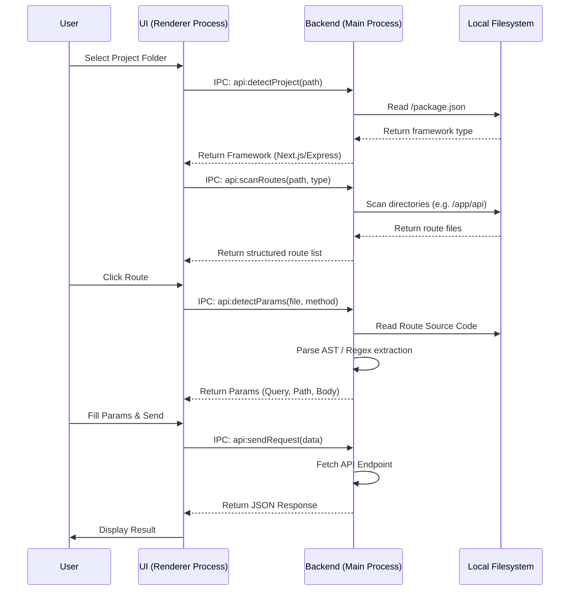
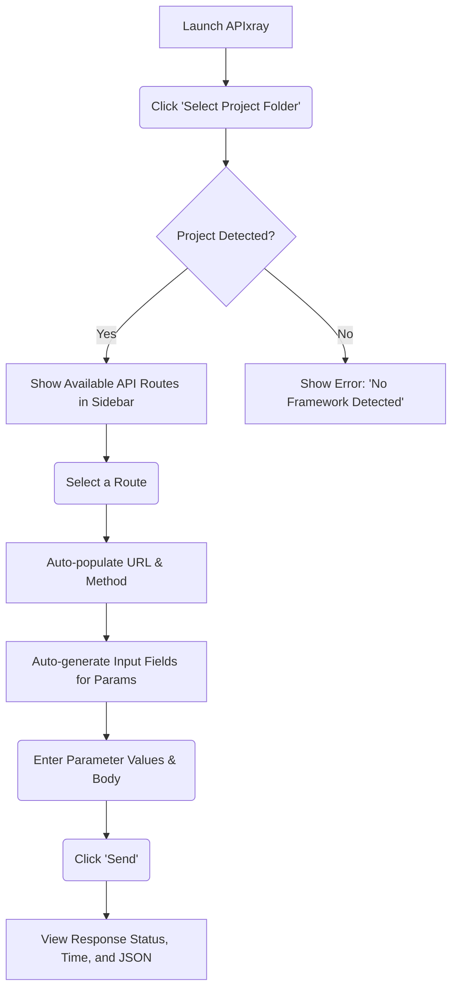

# APIxray 🩻

**APIxray** is a modern, fast, Postman-like desktop application built with Electron, Vite, and JavaScript. It automatically scans your backend projects (Next.js, Express) to instantly discover API routes and their required parameters (path, query, body), eliminating the need for manual endpoint configuration. 

---

## 🚀 Features

- **Auto-Discovery:** Just select your project folder. APIxray automatically detects your framework and scans for API routes.
- **Smart Parameter Extraction:** Automatically extracts required query parameters, path variables, and body fields from your code.
- **Modern Interface:** Built with Vite and Electron for a snappy, responsive UI.
- **No Manual Configuration:** Spend less time writing endpoint URLs and headers and more time testing.
- **Cross-Platform:** Available for Linux Only.

---

## 🛠️ Architecture Flow

The core mechanism of APIxray involves static code analysis paired with an Electron IPC bridge. Here is how it functions under the hood:



## 🌊 User Journey Flow



---

## 📦 Downloads & Releases

Pre-compiled binaries are available for Windows and Linux. 
*(If you are hosting this on GitHub, upload the built `.deb` files to the **Releases** tab on GitHub).*

- **[Linux (.deb) Package](https://github.com/MsCoder50/APIxray/releases/latest)**

---

## 💻 How to Use

1. **Launch the App:** Open the APIxray application.
2. **Select Project:** Click the **Select Project Folder** button at the top left.
3. **Choose Folder:** Pick the root directory of your Next.js or Express project.
4. **Select a Route:** Click on any of the auto-detected endpoints in the left sidebar.
5. **Fill Parameters:** APIxray will dynamically generate input fields for any Query Parameters, Path Variables, or Body Form fields it detects in your code. Fill them out.
6. **Send Request:** Click **Send** to execute the HTTP request and view the response data in the right-hand panel.

---

## 🛠️ Development & Building from Source

To run APIxray locally or build it for your own platform, follow these steps:

### Prerequisites

- Node.js (v16+)
- npm

### Installation

Clone the repository and install the dependencies:

```bash
git clone https://github.com/MsCoder50/APIxray.git
cd APIxray
npm install
```

### Running Locally

To start the application in development mode with hot-reloading:

```bash
npm start
```

### Building for Production

APIxray uses Electron Forge to create cross-platform executables.

**To build for Windows (.exe):**
*(Note: Best run on a Windows machine)*
```bash
npm run make -- --platform=win32
```

**To build for Linux (.deb / .rpm):**
*(Note: Best run on a Linux machine)*
```bash
npm run make -- --platform=linux
```

The compiled binaries will be output to the `out/` directory in your project folder.

---

## 🤝 Contributing

We welcome contributions! Whether it's adding support for new backend frameworks (like NestJS, Fastify, Django), fixing bugs, or improving the UI.

Please see our [CONTRIBUTING.md](./CONTRIBUTING.md) for details on our code of conduct, and the process for submitting pull requests to us.

## 📄 License

This project is licensed under the MIT License - see the [LICENSE.md](./LICENSE.md) file for details.

---
*Created by [MsCoder50](https://github.com/MsCoder50)*
